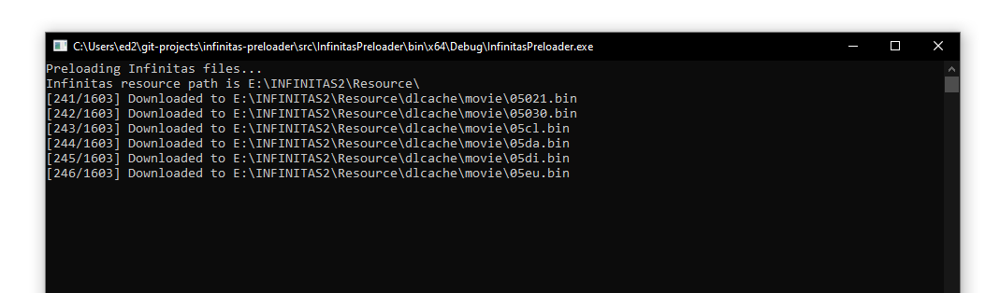

# IIDX Infinitas File Preloader

This app pre-downloads some music/movie/layer files direct from Konami to the IIDX Infinitas Resources directory.

### To use

1. Make sure Infinitas 2 is installed
2. Download the zip file from the releases page and unzip it somewhere
3. Run InfinitasPreloader.exe (making sure filelist.csv is next to it)
4. Wait quite a bit, you might need to run the app a few times



### Notes and limitations

The file list is currently limited to resource pack version 2021100600. To update the filelist.csv file, place a decrypted ```downloadlist.xml``` file next to the exe and run it with the ```-convert``` switch.

Some downloads might fail or the app might hang. Just run the app again and it will only download what it didn't manage to get the first time. Likewise it will also "fill in" the gaps in your download list (of songs it knows about).
